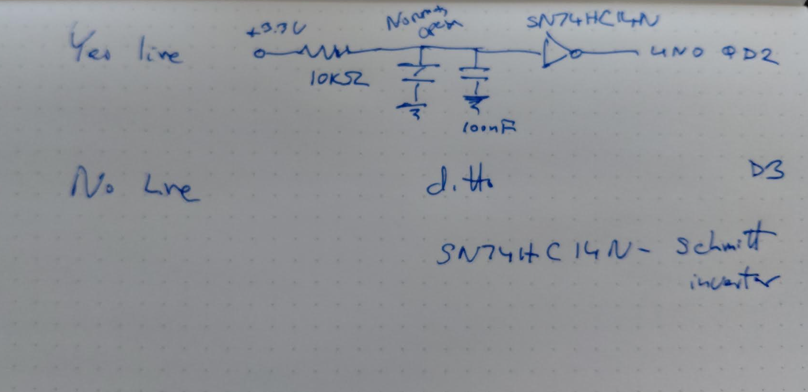

# Hardware Control Console

This document describes the planned physical interface for UNO Q Legal
Dictation. The goal is a purpose-built legal-work console rather than a generic
collection of modules: tactile controls select the transcription path, status
LEDs make the device state unambiguous, an RFID/NFC reader selects a client
matter, and a CH9328 emits completed text as ordinary USB keyboard input.

The microphone, local Whisper transcription, Azure Speech transcription, and
secure Azure launcher have been tested. The button, indicator, RFID, and
keyboard circuits described here are the next hardware integration stage.

## Design principles

- Use 3.3 V logic around the UNO Q GPIO connectors.
- Give important actions dedicated physical controls instead of relying on a
  touchscreen or a Windows companion application.
- Perform button conditioning in hardware and software.
- Keep USB keyboard output opt-in and visibly indicate when typing is armed.
- Store no client names or confidential matter information on RFID tags.
- Use sockets and connectors so serviceable parts can be replaced without
  desoldering the entire assembly.
- Reserve pins and board space for the planned e-ink display.

## System architecture

```text
USB microphone
      |
      v
+-----------------------+       UART       +------------------+
| Arduino UNO Q         |----------------->| Adafruit CH9328  |----> Windows
|                       |  text characters | USB HID keyboard |
| Linux: Whisper/Azure  |                  +------------------+
| MCU: controls/status  |
+-----+-----------+-----+
      |           |
      | GPIO      | I2C
      v           v
+-----------+  +----------------+
| 74HC14 +  |  | PN532 NFC/RFID |
| buttons   |  | matter selector|
+-----------+  +----------------+
      |
      v
 status LEDs
```

## Preliminary pin allocation

This allocation is intentionally conservative and should be confirmed against
the final UNO Q carrier and sketch before soldering.

| UNO Q signal | Planned function |
| --- | --- |
| D0 / RX | Reserved for UART diagnostics or future CH9328 receive data |
| D1 / TX | CH9328 keyboard data |
| D2 | Debounced YES button input |
| D3 | Debounced NO button input |
| D4 | Debounced LOCAL button input |
| D5 | Debounced CLOUD button input |
| D6 | Green READY/YES LED |
| D7 | Red ERROR/NO LED |
| D8 | Blue CLOUD mode LED |
| D9 | Amber LOCAL/BUSY LED |
| I2C SDA/SCL | PN532 RFID/NFC reader |
| D10-D13 | Reserved for a future SPI e-ink display |
| A0-A2 | Reserved for future e-ink control signals |

The final firmware can give LEDs multiple meanings through steady illumination
and deliberate blink patterns. Rapid decorative blinking should be avoided;
status must remain easy to interpret in an office setting.

## Bill of materials

Quantities in the **Buy** column include useful spares where appropriate.

### Button conditioning and indicators

| Buy | Used | Part | Specification or suggested search term | Purpose |
| ---: | ---: | --- | --- | --- |
| 2 | 1 | Texas Instruments `SN74HC14N` | Hex Schmitt-trigger inverter, PDIP-14, through-hole | Four button-conditioning channels, with two gates available for expansion; second IC is a spare |
| 2 | 1 | 14-pin DIP socket | DIP-14, 0.300 in/7.62 mm row spacing, 2.54 mm pitch, dual-wipe or machine-pin | Makes the logic IC replaceable |
| 10 | 5 | 100 nF ceramic capacitor | `0.1 uF`, radial through-hole, at least 16 V | Four RC button filters and one IC supply bypass capacitor |
| 10 | 4 | 10 kOhm resistor | 1/4 W, 1% or 5%, axial through-hole | Button pull-ups |
| 10 | 4 | 330 Ohm resistor | 1/4 W, axial through-hole | LED current limiting |
| 4 | 4 | Momentary pushbutton | Normally open, tactile or panel-mount | YES, NO, LOCAL, and CLOUD controls |
| 2 | 1 | Green LED | Diffused, through-hole | Ready, success, or affirmative status |
| 2 | 1 | Red LED | Diffused, through-hole | Error, cancel, or negative status |
| 2 | 1 | Blue LED | Diffused, through-hole | Azure/cloud mode status |
| 2 | 1 | Amber LED | Diffused, through-hole | Local mode or processing status |
| 1 pack | as needed | Breakaway headers | 2.54 mm male and female headers | Removable inter-board connections |
| 1 kit | as needed | Hookup wire | 22-24 AWG solid-core, several colors | Protoboard wiring |

The exact logic part should be `SN74HC14N`. The `N` suffix identifies the
through-hole PDIP package; `D`, `PW`, and similar suffixes identify
surface-mount packages. The device operates from 2 V to 6 V, so it can be
powered from the UNO Q 3.3 V rail. See the
[TI SN74HC14 product page](https://www.ti.com/product/SN74HC14) and
[SN74HC14 datasheet](https://www.ti.com/lit/ds/symlink/sn74hc14.pdf).

### RFID/NFC matter selection

| Buy | Used | Part | Specification or suggested search term | Purpose |
| ---: | ---: | --- | --- | --- |
| 1 | 1 | Adafruit PN532 NFC/RFID breakout | Adafruit product 364, 13.56 MHz, I2C/SPI/UART | Reads the tag identifier used to select a matter |
| 1 | 1 | Qwiic breakout cable or pigtail | JST-SH 4-pin to four breadboard/Dupont conductors | Brings the UNO Q I2C/Qwiic signals onto the protoboard for wiring to the PN532 |
| 20 | as needed | NTAG213 tags | 13.56 MHz, ISO/IEC 14443 Type A; cards, stickers, or key fobs | Provides one physical selector per frequently used matter |
| 1 set | as needed | Nylon standoffs and screws | M2.5 or M3 assortment | Mounts the reader securely and away from metal |
| 1 | 1 | Nonmetallic enclosure or faceplate | Plastic or wood around the antenna area | Protects the reader without blocking RF communication |

The PN532 includes a tuned antenna and supports I2C, SPI, and UART. This design
uses I2C, leaving the hardware UART available for the CH9328. The PN532 does not
have a Qwiic socket, so the breakout cable terminates on the protoboard rather
than plugging directly into the reader. Verify 3.3 V, ground, SDA, and SCL by
signal name instead of assuming that wire colors or connector positions match.
See the
[Adafruit PN532 breakout](https://www.adafruit.com/product/364) and
[PN532 guide](https://learn.adafruit.com/adafruit-pn532-rfid-nfc).

[NTAG213 tags](https://www.adafruit.com/product/4032) are compatible with the
reader and provide a seven-byte unique identifier. The included PN532 test card
can be used during development.

### Already selected or available

| Qty | Part | Function |
| ---: | --- | --- |
| 1 | Arduino UNO Q 4 GB | Linux speech processing and real-time I/O control |
| 1 | Adafruit CH9328 UART-to-HID Keyboard Breakout | Types completed text into the focused Windows application |
| 1 | Arduino USB-C Hub | Connects the microphone and other USB peripherals |
| 1 | Arduino 45 W USB-C power supply | Powers the UNO Q and attached USB devices |
| 1 | USB microphone | Captures dictation audio |
| 1 | Arduino-compatible protoboard starter kit | Provides the initial construction platform |

## Button circuit

Each button uses one inverter in the `SN74HC14N`:



*Figure 1. Engineering-notebook sketch of one button channel. The normally-open
momentary switch and 100 nF capacitor are parallel connections from the input
node to ground. The illustration shows electrical connections, not physical
component placement.*

```text
                       10 kOhm
3.3 V ----------------/\/\/\----+------> 74HC14 input
                                 |
                                 +--||-- GND     100 nF
                                 |
                                 +--o  button
                                    o-- GND

74HC14 output --------------------------> UNO Q GPIO input
```

When the button is released, the resistor pulls the inverter input high and its
output is low. Pressing the button pulls the input low and produces a high GPIO
signal. The capacitor suppresses short contact disturbances, while the
Schmitt-trigger input provides clean switching as the capacitor charges and
discharges.

The `10 kOhm` and `100 nF` components have a nominal RC time constant of about
1 ms. Firmware should still require a stable state for approximately 20-30 ms
before accepting a press. Combining analog filtering, hysteresis, and software
qualification is more reliable than relying on any one technique alone.

### SN74HC14N installation details

- Pin 14 connects to 3.3 V and pin 7 connects to ground.
- Place a 100 nF bypass capacitor directly between pins 14 and 7.
- Do not leave either unused inverter input floating; tie each unused input to
  ground or 3.3 V.
- Unused inverter outputs may remain disconnected.
- Orient the socket notch and IC notch in the same direction and mark pin 1 on
  the protoboard silkscreen or assembly drawing.
- Fit and test the socket before inserting the IC.

One proposed gate assignment is:

| Control | Inverter input | Inverter output | UNO Q input |
| --- | ---: | ---: | --- |
| YES | Pin 1 | Pin 2 | D2 |
| NO | Pin 3 | Pin 4 | D3 |
| LOCAL | Pin 5 | Pin 6 | D4 |
| CLOUD | Pin 9 | Pin 8 | D5 |
| Future push-to-talk | Pin 11 | Pin 10 | To be assigned |
| Spare | Pin 13 | Pin 12 | Not connected |

Until the fifth gate is used, pins 11 and 13 should be tied to ground and pins
10 and 12 left disconnected. This table is a wiring proposal, not a substitute
for checking the package diagram in the TI datasheet before assembly.

## LED behavior

Each LED is driven from a dedicated GPIO through a 330 Ohm series resistor. A
proposed initial status vocabulary is:

| State | Indication |
| --- | --- |
| Ready | Green steady |
| Recording locally | Amber steady |
| Local transcription processing | Amber slow pulse |
| Recording for Azure | Blue steady |
| Azure request processing | Blue slow pulse |
| Text armed for keyboard output | Green slow pulse |
| Successful completion | Green brief flash |
| Cancelled | Red brief flash |
| Error or unavailable service | Red repeating pattern |

Firmware must initialize every LED output to off before completing startup so
that power-on transients cannot falsely indicate that keyboard output is armed.

## Proposed control behavior

The first firmware version can keep the interaction intentionally simple:

1. Present an RFID tag to select a client matter.
2. Press LOCAL to record and transcribe without sending audio to Azure.
3. Press CLOUD to record and transcribe through Azure Speech.
4. Press YES to approve keyboard output or confirm a prompted action.
5. Press NO to cancel the pending result or action.

The LOCAL and CLOUD buttons can initially serve as both mode selection and
push-to-talk controls. A separate momentary push-to-talk button can be added
later using either of the two unused Schmitt-trigger channels.

## RFID privacy and data model

The RFID tag is a convenient physical selector, not an authentication device.
Tag identifiers can be copied, and a lost tag may be read by another compatible
reader. Therefore:

- Store only the tag UID on the tag-facing side of the workflow.
- Keep the UID-to-client/matter mapping in a protected local configuration or
  retrieve it from an authenticated PatVault service.
- Never write a client name, matter description, patent strategy, billing
  information, or other confidential data onto the tag.
- Display or announce a nonconfidential confirmation before recording when
  practical.
- Treat an unknown tag as an error and never silently select a default matter.

A future mapping record might associate a UID with an internal matter ID and a
display alias, but it should not contain the Azure Speech credential. The Azure
credential remains in the separately protected environment file already used by
the speech launcher.

## Mechanical and assembly notes

- Prototype one button and one LED first, then reproduce the verified channel.
- Use a common ground among the UNO Q, SN74HC14 circuit, PN532, and CH9328 UART
  connection.
- Do not connect the CH9328 VCC pin to the UNO Q when both devices are already
  powered by their USB connections.
- Mount the PN532 antenna behind plastic or wood, not directly against a metal
  panel, ground plane, power supply, or large bundle of wiring.
- Keep the 100 nF IC bypass capacitor leads short.
- Use color-coded wiring consistently: red for 3.3 V, black for ground, and
  distinct colors for signals.
- Label both ends of every off-board cable before final assembly.
- Check continuity and absence of shorts with power disconnected before
  installing the IC or connecting the UNO Q.

## Bring-up sequence

1. Assemble the 3.3 V rail, ground rail, DIP socket, and bypass capacitor.
2. Verify 3.3 V at socket pin 14 relative to pin 7 before inserting the IC.
3. Build and test one button channel with a multimeter and a minimal GPIO sketch.
4. Add the remaining three button channels and software debounce.
5. Add LEDs one at a time and verify their current-limiting resistors.
6. Connect the PN532 over I2C and confirm reliable reads using the supplied test
   card before creating any matter mappings.
7. Connect the CH9328 UART and test only in a disposable text document.
8. Integrate the controls with local and Azure transcription.
9. Perform power-cycle, unknown-tag, network-loss, and accidental-button tests.

## Future expansion

- A dedicated push-to-talk button using a fifth `SN74HC14N` gate.
- An e-ink display showing mode, selected matter alias, transcript review, and
  keyboard-output state.
- A lockable or removable matter-tag set.
- CSV time-entry creation and controlled submission to the PatVault API.
- A fabricated PCB after the protoboard circuit and connector placement have
  been validated in regular use.
